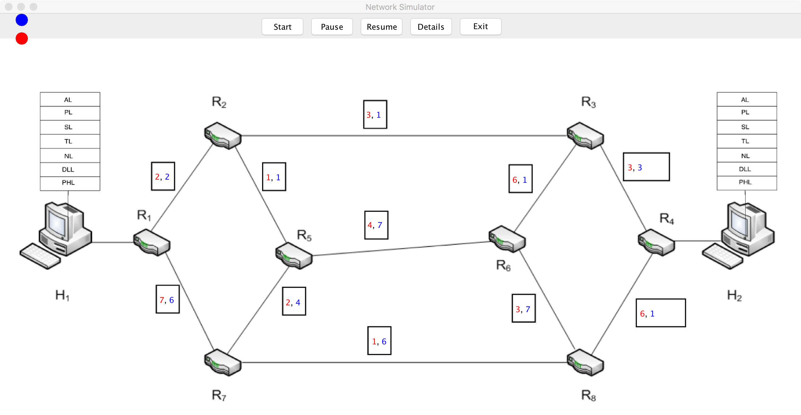
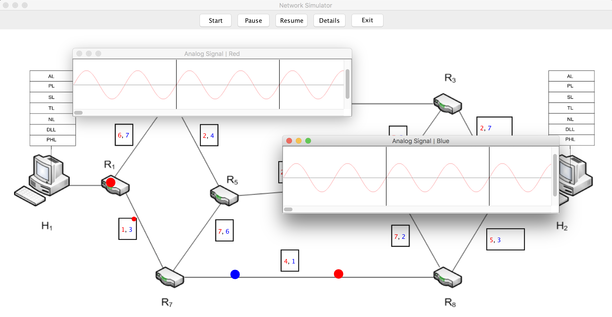

# Network-Simulator

A animated simulator illustrate how data be transmitted in a TCP/IP network. Details button show different forms of messages as they are transmitted from one end to the other through all layers.

## Layer Function

* Headers are added at each layers.
* Data is tranformed into frame with CRC checksum for error detection in Datalink layer.
* Frames are tranformed into binary sequence in physical layer and be present with analog wave.

## Routing

* Dijkstra is implemented to find a shorest path for each packet based on random-generated path weights.
* Demonstrate the ACK schema, nodes will keep a duplication of packet until it receive a ACK reply.

